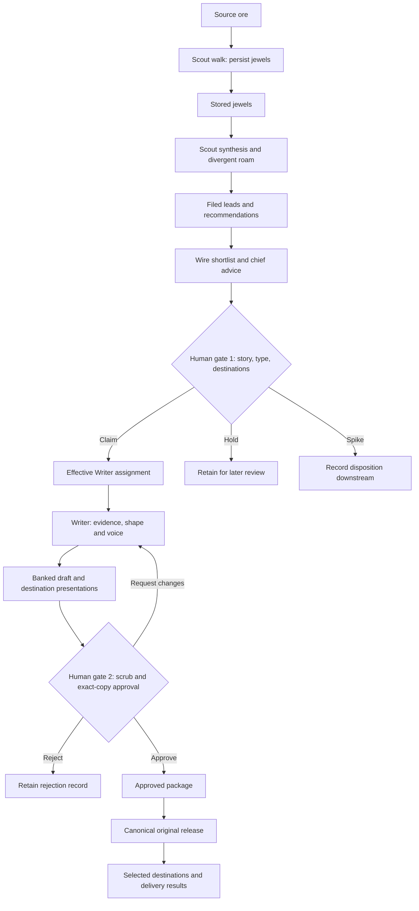
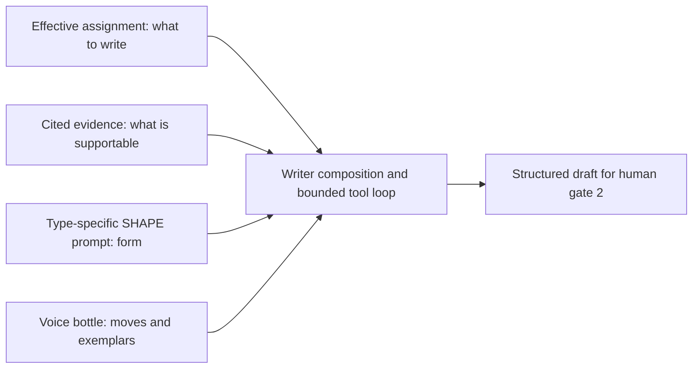

# NEWSROOM — system and workflow specification

This is the single specification for the NEWSROOM workflow: what it is for,
which role owns each decision, how evidence becomes published work, how voice
enters a draft, and what the editorial interface must support. It consolidates
the recent desk specifications, operator decisions, UI proposal and compatibility
findings without changing the design.

The main flow describes the system. Dated implementation observations are kept
in their own section so an unfinished capability does not redefine that flow.
The document is a reference specification; read the relevant sections together
with their cross-cutting constraints before changing a component.

<!-- MAP:START -->
- [1. Document authority and decision status](#1-document-authority-and-decision-status)
- [2. Purpose, outcome and scope](#2-purpose-outcome-and-scope)
- [3. Roles and non-negotiable boundaries](#3-roles-and-non-negotiable-boundaries)
- [4. Vocabulary and information contracts](#4-vocabulary-and-information-contracts)
- [5. End-to-end workflow](#5-end-to-end-workflow)
  - [5.1 Capture, walk and retained findings](#51-capture-walk-and-retained-findings)
  - [5.2 Scout synthesis and filing](#52-scout-synthesis-and-filing)
  - [5.3 Wire shortlist and chief advice](#53-wire-shortlist-and-chief-advice)
  - [5.4 Human gate ① and the effective assignment](#54-human-gate-①-and-the-effective-assignment)
  - [5.5 Draft, review and release](#55-draft-review-and-release)
- [6. Content types, voice registers and destination independence](#6-content-types-voice-registers-and-destination-independence)
  - [6.1 Shape by type](#61-shape-by-type)
  - [6.2 Canonical, metadata and publishing constraints](#62-canonical-metadata-and-publishing-constraints)
- [7. How the voice bottle enters a draft](#7-how-the-voice-bottle-enters-a-draft)
- [8. Editorial interface contract — proposed MVP](#8-editorial-interface-contract--proposed-mvp)
  - [UI-01 — current inputs and refresh](#ui-01--current-inputs-and-refresh)
  - [UI-02 — routing desk, gate one](#ui-02--routing-desk-gate-one)
  - [UI-03 — draft desk, gate two](#ui-03--draft-desk-gate-two)
  - [UI-04 — publication and delivery](#ui-04--publication-and-delivery)
  - [UI-05 — durable decisions and the execution boundary](#ui-05--durable-decisions-and-the-execution-boundary)
  - [UI-06 — presentation and effort](#ui-06--presentation-and-effort)
- [9. Persistence, lifecycle and recovery — proposed MVP](#9-persistence-lifecycle-and-recovery--proposed-mvp)
- [10. Operating controls, budgets and observability](#10-operating-controls-budgets-and-observability)
- [11. Implementation baseline and known gaps](#11-implementation-baseline-and-known-gaps)
- [12. Open choices and deferred scope](#12-open-choices-and-deferred-scope)
- [13. Acceptance and construction traceability](#13-acceptance-and-construction-traceability)
- [14. Source register and reconciliation](#14-source-register-and-reconciliation)
- [15. Revision record](#15-revision-record)
<!-- MAP:END -->

## 1. Document authority and decision status

This file owns the current **NEWSROOM system requirements**. The four former
desk specs and the editorial UI MVP spec are retained as source snapshots with
dated supersession notices. They no longer provide competing current rules.
The source register in §14 makes the consolidation traceable.

Use these labels throughout:

| Label | Meaning |
|---|---|
| **Established** | An existing design rule or explicit operator decision, carried forward without reopening it. It does not assert that every enforcement path works. |
| **Proposed MVP** | A requirement already proposed in UI specification revision 0.2 and work-plan revision 0.6. Consolidation does not ratify it. |
| **Observed** | Dated implementation evidence. Recheck it before an operating action. |
| **Open / deferred** | An unresolved choice or deliberately unscheduled capability; do not fill it with an implementation assumption. |

Sections 2–7 contain established rules except where marked otherwise.
Sections 8–9 and their acceptance demonstrations carry the proposed MVP
contract. Sections 10–13 distinguish operations, observations, open choices and
construction acceptance explicitly.

[NEWSROOM-WORKPLAN.md](NEWSROOM-WORKPLAN.md) remains the only construction
task/status board and the owner of accepted sequence, dependencies, decision
status and completion evidence. Its NR and D identifiers are reused here.
Specification revision 1.0 does **not** mean plan revision 1.0: NR-00 remains
active until the operator accepts a construction baseline.

The existing cross-project authorities remain in force:

- [SEO policy](/opt/_host/SEO.md) owns canonical, indexing, cadence and technical
  publishing policy. This spec incorporates only the operational NEWSROOM
  contract, including its September 9 amendment. It does not republish the
  private SEO rationale or create a second SEO doctrine.
- [AGENTS.md](../../AGENTS.md) routes shared database, source-access, calendar
  and publication boundaries to their authorities. SQL remains the executable
  schema; a proposed schema is not evidence that it is installed.
- [GLOSSARY.md](GLOSSARY.md) and the [voice glossary](../../voice/README.md)
  supply vocabulary and retired-term lookup. Current workflow requirements live
  here; historical descriptions in either glossary do not override them.
- [NEWSROOM.md](NEWSROOM.md), ADRs, dated reviews and run records explain why
  decisions were made. The September 8 critique remains verbatim. The interactive
  manual illustrates this specification; it is not a separate rule source.

Maintain current requirements here in place, recording the date, changed
section and decision basis in §15. A changed boundary must name the decision
that authorizes it. Update affected prompts, consumers, extracts and explanatory
views deliberately; a discrepancy is a gap to record, not permission to choose
new policy. Changes to construction scope/order/acceptance also belong in the
work plan's change record. Historical source bodies remain preserved.

## 2. Purpose, outcome and scope

NEWSROOM turns the platform's own working evidence into useful public writing.
It addresses insight evaporation: worthwhile incidents, investigations,
corrections and decisions should not depend on the operator remembering and
retelling them later. The Scout discovers widely; the Editor chooses; the
Writer develops the selected story; deterministic machinery presents and
delivers the approved work.

The operator's current goal is regular content on their own website, DEV and
a third destination, provisionally Hashnode, with writing close to what they
would have produced and roughly **90% less recurring personal effort**. Both
specified editorial gates remain human. Acceptable MVP writing may begin live
publication, with subsequent pieces improving through operation. Achieving the
full effort reduction is measured over real releases, not required before the
first acceptable release.

The system includes discovery, evidence retention, advisory triage, human
routing, drafting, scrub/review, canonical publication, independent syndication
and recovery. The MVP adds a coherent routine across Stories, Drafts and
Publishing. It does not require all five content-creation paths, every source
reader, a general CMS, a new visual brand, richer dashboards, or automatic
transfer of either human gate.

The existing predictor/commit-history blog remains a distinct production path:
content agent → extraction/packaging by Marketer → Ghost draft → human review.
Share stable mechanics where appropriate; preserve different input, voice,
canonical and link-corpus assumptions. A new type requires an explicit type,
profile/shape and sink decision, not a new agent by default. A profile directory
alone does not implement an unsupported output or delivery adapter.

## 3. Roles and non-negotiable boundaries

| Role | Responsibility and output | Boundary |
|---|---|---|
| Scout intake | Capture transcript ore with provenance | Capturing logs does not itself invoke models or make editorial decisions. |
| Scout | Walk ore, retain jewels, explore, synthesize and file leads; recommend type and destinations | Files leads, never drafts. Learns navigation, never editorial taste. Never edits/removes a filed lead. |
| Wire Editor | Read new leads and propose claim, hold or spike, clustering and type advice | Proposals only; never writes the lead ledger, drafts, or feedback to Scout. |
| Editor-in-chief | Director's separate editorial invocation; agree/differ with the shortlist and explain | Reads the compressed shortlist, not the raw queue; advice never disposes a lead. |
| Editor / operator | Gate ①: choose story, type and destinations. Gate ②: scrub and approve exact finished content | Both gates stay human for the current goal. Gate ② is permanently human. |
| Writer | Develop one effective claimed assignment into one structured draft of one type | Cannot route, spike, approve, publish or write HTML; flags concerns in its handoff. |
| Marketer | Blog per-item text and packaging | Remains on the Ghost blog path; note metadata belongs to the Writer. |
| Rendering and delivery machinery | Validate, render, release and deliver the approved artifact, recording outcomes | Does not invent editorial copy or substitute an unapproved version. |

**The pineapple rule.** The Scout learns where and how to look, never what the
Editor likes. No disposition columns on jewels, no status in dedup context,
no editorial verdict in a Scout prompt. Spiking one lead never means avoiding
that kind of lead. The same restriction must hold through real database roles,
read/search/Git tools, archives and generated copies. Normal status-blind
parsing alone is insufficient enforcement (§11).

**Evidence and privacy.** Preserve raw transcript text. A pitch paraphrases and
points; neither pitches nor drafts reproduce credentials or private data.
Citations themselves are publishable text. Gated material requires an opaque
reference before mining, with a private resolver; that resolver is still open
work. An inaccessible reference must be visible as an evidence gap. Employer
material is technique-forward and application-anonymous; this routing flag is
distinct from the secret/PII scrub and is never a reason to spike a story.

**Editorial fidelity.** Preserve uncertainty as well as facts. A plausible
explanation must not become an established cause in the draft. Counts, dates,
claims and receipts must be supported; further investigation or qualified
writing replaces invention. Discovery diversity and deliberate improvement of
Writer exemplars are compatible; editorial learning does not return to Scout.

**Separation of actions.** Human approval, model execution, content release,
Scout resumption and source-code push are distinct acts. There are two
editorial gates. An optional execute/release action or a delivery retry does
not add a third gate, and approval does not implicitly resume prospecting or
publish source code.

## 4. Vocabulary and information contracts

| Concept | Meaning and contract |
|---|---|
| Type | What a piece is: ticker, newsletter, note, blog or paper. Exactly one per piece. |
| Register | Its tonal band; a property of a type, not another name for type. |
| Destination | Independently recommended/selected publication endpoint. It does not determine type. |
| Sink | The own-site rendering/storage path, such as apex notes or Ghost. |
| Source / stance | Source is the kind of ore. Stance is its relation to events: struggle in progress, decision afterward, unattended operation, or doctrine/derived account. |
| Ore | Raw material: captured transcript rows, commits and source files. |
| Reader / splitter | Reader supplies mineable pages and valid anchors. A splitter defines a file's units, anchors, dates and stance. Retention is different from tool access. |
| Page / plate | Page is one triage call's bounded input. Plate is a daily pass's total transcript-row allowance. |
| Jewel | A durable finding that the walk identifies and persists: kind, concise note, source type/date and anchor. It carries no editorial disposition. |
| Anchor | Pointer back to the shown source record: transcript sequence or non-transcript source reference. Validate it against the page shown to triage. |
| Scratchpad / map | Scout-owned opaque arc breadcrumbs and navigational notes. Downstream readers do not parse scratchpad as structured editorial data. |
| Synthesis / roam | Scout synthesis turns selected jewels and context into leads; its roam explores broadly. Writer roam converges on the selected assignment's evidence. |
| Lead | Stable slug ID, filed date, status, type, pitch, why-now, citations, agent span, model and redaction flag. The independent destination recommendation is established policy with wiring pending. |
| Pitch / why-now | Two-to-four-sentence abstract; one sentence on timeliness or durability. |
| Citations | The lead's evidence pointers, distinct from source kinds. Existing consumers call the field `sources`; schema 006 calls it `citations`. Translation must preserve values. |
| Agent span | Weight based on distinct names in cited decision sequences, never a discovery filter. Its current string-count limitation is unresolved. |
| Dedup memory | ID plus first-sentence pitch digest, at most 240 characters, for every lead ever pitched. Append-only, status-blind, never pruned by queue cleanup. |
| Canonical home | The actual original URL for a piece. A syndicated copy identifies that original; a distinct-intent deep dive has its own original. |

Filed dates, source-record dates and event dates are different. A document's
modification date does not prove when an event occurred. Source date/type
clustering assists editorial judgment; it does not establish chronology or
causality by itself. A lead *about* multiple agents is a story, not evidence
that those agents are currently running.

## 5. End-to-end workflow



The diagram shows responsibility and data flow, not automatic job triggers.
D-06 controls whether claim starts drafting; D-04 controls whether approval
enters cadence or awaits execution. There is no editorial return path to Scout.
Revisioned packages and the correction loop are the proposed MVP enforcement
of the existing two-gate design.

### 5.1 Capture, walk and retained findings

The source vocabulary comprises transcript, git, doc, ledger, calendar, survey
and `agent_decisions`. No type quota or preferred content format narrows the
Scout's discovery aperture. When unsure, retain the candidate finding.

| Source | Retention path and anchor | Boundary / maturity |
|---|---|---|
| Transcript | Ingest to `scout_session_log`; walk rows by sequence cursor; anchor `seq` | Raw text is retained; triage reads clipped pages. |
| Git | `git_ore.py`; `repo@sha`; explicit date/range walk | Mining repositories and roam roots differ; D-01 remains open. |
| Doc / ledger | Shared `file_ore.py`; H2 section / dated entry splitter; `repo/path#anchor` | Explicit path walk; three-root path restriction. Dates/versioned references have known limitations. |
| Calendar / survey | Available for permitted exploration | VTODO/YAML splitters are named, not built. The marketing survey is not the lead ledger. |
| Agent decisions | Cross-agent sequences supply synthesis context | A dedicated mining reader is blocked on defining the unit of a sequence. |

The walk creates jewels. For each page it identifies findings, validates their
anchors against the actual input, persists valid jewels, and records dropped
invalid anchors. Transcripts can also receive scratchpad breadcrumbs; map notes
carry navigational learning. Ingestion alone does not create jewels. Synthesis
consumes jewels and creates leads.

Transcript pages default to 150 rows clipped to 1,200 characters each; the full
text remains stored. A daily pass defaults to a 150-row plate: fresh ore first,
then backfill with the remaining allowance, stopping where forward stood.
Forward never retreats and advances only after persistence. Explicit `--walk`
does not move either pass cursor. Re-walking is a new mining run; exact
re-findings are idempotent, not editorial corrections.

The named jewel kinds are principle, correction, reframe, decision and aha.
Whether the vocabulary is closed remains open; historical extra kinds must not
be silently recategorized. Git's measured page default is 50 commits; a file
page's 30 units is an estimate awaiting its first live document experiment.

### 5.2 Scout synthesis and filing

Select stored jewels by date window, kind, source type, mining run or limit,
ordered by source date across sources. A pass selects its own walk's jewels.
Synthesis receives the selection, cross-agent decision sequences, the last
4,000 characters of the map, a bounded box index and status-blind dedup digests.
The index describes up to 300 readable text files within registered roots;
index omission is not an access restriction.

Scout roam uses `read_transcript`, `read_file`, `grep` and `run_git` inside the
registered roots: `ai-agent-platform`, `uzelhub-web` and `predictor_ingest`.
The differing git-mining list remains subject to D-01; this list does not
resolve that choice. Its default six tool rounds have capped results, followed by
a forced pitch with tools disabled. One tool-less fallback retry handles
refusal. Truncation must fail loudly; empty responses are captured for diagnosis
and must not masquerade as a successful zero-lead run.

Scout generates widely; false positives are cheap because the Editor selects.
Span adds weight, never filters. Dedup excludes essentially identical pitches,
not categories the operator has rejected. File strict structured leads with
immutable IDs, model and filed date, `status: new` and `redaction: required`.
The independent type/destination proposal stays distinguishable from later
advice and human choice. Missing legacy destination advice remains missing.

### 5.3 Wire shortlist and chief advice

The Wire Editor reads each new lead's identity, pitch, type, why-now, citations
and span, along with already disposed IDs. It clusters related material and
proposes one verdict per new lead, with confirmed/corrected type and a concise
reason. It records an artifact containing clusters, proposals and the chief's
shadow, then stops. Both model invocations belong on the decision trace.

| Proposal | Meaning |
|---|---|
| Claim | Worth a Writer assignment; name the proposed type. |
| Hold | Real story, not ripe; state what it awaits. A fold identifies its target lead. |
| Spike | This lead is not a story or is spent; never generalize the verdict. |
| Missing proposal | Surface explicitly as a hold needing operator judgment, rather than dropping the lead. |

Use source dates and stances, not filing dates, to distinguish:

- **Angles:** one event with several tellings; claim the strongest and propose
  other angles as holds folded into the explicit target ID.
- **Corroboration:** one date across different source types/stances; keep the
  evidence and claim a story citing both.
- **Arc:** development over time; never fold episodes into the first. Hold the
  parts naming the arc, or claim the arc with all parts cited.

The existing one-date/one-source, one-date/many-source and many-date heuristic
guides this assessment; the chronology limitations in §4 remain visible.
Publication capacity constrains order, never what the evidence record retains.
Notes favor self-awareness first and war stories second at routing; that
editorial preference must not become a Scout discovery filter.

The chief reads the compressed shortlist and stakes agree/differ, with its own
verdict, type and reason. Human concordance compares advice with actual human
marks; agent-marked actions are excluded. The older possibility of transferring
gate ① after sustained concordance is historical, not the current goal.
Renaming the shadow field from `stance` to `position` and ensuring explicit
fold IDs remain NR-04 work; the naming change does not solve evidence quality.

### 5.4 Human gate ① and the effective assignment

The operator claims, holds or spikes the story, and accepts or overrides type
and destinations independently. Defaults come from the Scout's recommendation,
not an all-platform default and not an overwritten Wire suggestion. Preserve
Scout proposal, Wire/chief advice and actual human values with their attribution.
A change of type must not reset destinations or vice versa. A field note can
reach DEV without becoming a blog article or acquiring a companion piece.

**Proposed MVP:** persist routing as a revision-aware decision. Explicit Hold
records human review while untouched means unreviewed; neither creates a new
lead lifecycle state. The Writer consumes an effective assignment projected
from the saved human type/route, with stable lead identity and citations. A
UI-only override that the Writer cannot read is not an applied decision.

### 5.5 Draft, review and release

The Writer accepts a claimed lead, or a drafted lead for redrafting; it does
not accept a raw idea or routing question. Each assignment starts cold, with
the selected profile as wardrobe rather than memory. A dry run can rehearse
other statuses without persisting. Writer CLI uses `--lead <id>`.

The Writer pulls the cited threads until it can write from receipts. It returns
structured copy with citations and provenance, parked outside the public tree.
The pipeline supplies the `copyDraft` stamp; the model never authors its own
provenance stamp. Landing a draft records a Writer-attributed drafted move.

Gate ② belongs to the human Editor: inspect actual copy, supporting evidence,
uncertainty, voice, metadata and scrub. Rejection is a judgment of the draft,
distinct from spiking a lead. A correction request is distinct from terminal
rejection. A clean automated scan does not constitute editorial approval.

**Proposed MVP:** gate ② approves a specific package containing the draft
revision and all selected destination presentations. Editing creates a new
revision; correction instructions reach the Writer with the prior version
preserved. Changed content/route/metadata supersedes package approval without
rewinding lead history. Release verifies the current approved package, then
publishes the canonical original and the selected copies, with independent
delivery outcomes and recoverable execution (§§8–9).

## 6. Content types, voice registers and destination independence

| Type | Purpose | Own-site sink | Register / voice | Creation coverage at consolidation |
|---|---|---|---|---|
| Ticker | Rolling activity pulse in verbs | Masthead text pack, generator-native; survey source in v1 | Terse verb crawl, no profile | Scout can pitch; no dedicated Writer desk, a claimed pitch may supply the line. |
| Newsletter | Weekly public digest of the Director's report | Apex `/newsletter/`, self-canonical, generator-native | Newspaper broadsheet, profile to be seeded | Scout can pitch; creation path awaits the weekly pass/profile. |
| Note | Short field note with receipts | Apex `/notes/`, self-canonical; notes data rendered by generator | `man-page-dry`, harvested | Note Writer path exists. |
| Blog | Narrative, deep dive and commit-history writing | Ghost, with the actual blog original's canonical | Narrative, harvested from published posts | Content-agent/blog path exists; current NEWSROOM lead integration still needs demonstration. |
| Paper | Rigorous white paper/case study | Deliberately unplaced | Formal, technical | Scout pitches an abstract with references; no Writer path. |

The table describes own-site paths and creation coverage, **not permitted
syndication pairings**. D-00/D-02 establish that type and destination are
independent, with Scout recommendation and human override. Delivery capability
is checked explicitly; an unavailable adapter leaves a visible unresolved
destination, never a silently removed choice or a type conversion.

### 6.1 Shape by type

- **Ticker:** one tip-length line with a verb. Verbs, not victories; no wit.
  A challenge appears as its resolution verb, linking to the note carrying
  the fuller account. It rolls on regeneration.
- **Newsletter:** headline, deck and digest item in active, present-tense
  newspaper voice; two columns wide and one on a phone; weekly cadence.
- **Note:** problem, solution and lessons learned; one screen. Body is
  **840 characters ±5% (798–882)** across sections and bullets. Tolerance is
  slack, not a padding target. Enumerable receipts are list entries containing
  the full receipt. Optional Quick-context cites at most four existing lexicon
  keys; introduce other terms inline. Title, tagline and metaDescription are
  required and in register. The schema escapes values; no table or hidden HTML.
- **Blog:** 600–1,200 words explaining what changed, why, decisions and lessons.
  Use perfect tense and avoid wall-clock phrases such as “this week”; the
  deliberately backdated commit-history corpus makes this constraint essential.
  Use a Mermaid flowchart only
  where prose would obscure structure. Marketer supplies per-item packaging.
- **Paper:** the current pitch is a defensible abstract with evidentiary
  references. A complete writing/shape/sink contract remains unchosen.

The note output is a notes-data-shaped entry: `slug`, `kicker`, `date`,
`title`, `tagline`, `metaDescription`, `bullets`, `sections` and citations,
with optional image/context and an optional `deepDive` under the rule below.
Pipeline-owned provenance accompanies that copy; it is not model-authored.

### 6.2 Canonical, metadata and publishing constraints

Incorporate the current operational rules from [SEO policy](/opt/_host/SEO.md),
especially its September 9 clarification:

- A syndicated copy identifies its corresponding original: apex for a copied
  note, blog for a copied article. It does not automatically canonicalize to
  the apex because of an old notes-only adapter or instruction.
- A deep dive has distinct intent, is self-canonical and indexed. A rare
  retelling identifies the note as original. A note is complete without either.
- `deepDive` is optional. If present, publish that destination first so the
  link works. A note and its distinct-intent deep dive have different titles.
- Packaging may change supported formatting, title and metadata while
  preserving approved claims and voice. Substantive variants belong in gate ②.
  Unsupported canonical or presentation capabilities are explicit blockers.
- Apex metadata includes authored metaDescription at most 160 characters,
  canonical, social and structured metadata rendered by deterministic machinery.
  Empty optional platform metadata is omitted instead of emitted as a placeholder.
  The existing syndication contract includes canonical and at least two body
  links back to the operator's apex; LinkedIn, if selected, is excerpt-only.
- Notes publish one or two per week with a three-day minimum gap, enforced by
  the release mechanism. Apex `published` is the real release day, never
  backdated. Blog corpus dating is a different, deliberate policy.

SEO responsibilities stay distributed: generator owns structural/on-page
rendering; Writer owns note text/metadata; Marketer owns blog text/packaging;
infrastructure and Editor routing implement technical directives under the SEO
authority; link-graph work and operator aftercare keep their existing scope.
Unbuilt link ranking, Ghost routing/tag work and site fixtures are dependencies
to check for the selected route, not implicitly completed by this specification.

## 7. How the voice bottle enters a draft

Written voice is a register demonstrated by examples, not recorded audio or a
model's personal memory. Four inputs converge in the Writer's context:



Assignment and retrieved receipts supply the story. The type-specific shape
and selected bottle supply form and register. These constraints act together
while the Writer composes. Voice is not a finishing rewrite after the facts
have been drafted. The manual's “Writer synthesis” means composition here; it
does not mean the Scout's jewel-to-lead synthesis stage or promise a single API
invocation regardless of tool use.

The bottle mechanism loads `voice/<profile>/moves.md` when present and sorted
files from `voice/<profile>/samples/`, appending the profile block to the Writer's
prompt. Samples appear as exemplars at runtime. A missing profile or empty
sample directory hard-fails; a moves list alone is insufficient. The loader
can render JSON or prose samples without imposing a new sample schema.

Samples carry the voice; named moves stay deliberately thin. Harvest examples
where the voice already exists; seed them through the operator where it is
aspirational. Several examples should agree on structure and differ in rhythm,
including one without wit. Wit is watched for when it crystallizes a fact,
never commissioned. A single sample tends to become a stencil.

**SHAPE lives in the prompt, voice in the bottle.** Shape follows the selected
type; the note's three beats and character range are one type's contract, not
the form of every piece. When SHAPE changes, recut its samples in the same
change because examples can outweigh written instructions. Deterministic
validation enforces measurable limits after drafting.

The built note path uses `man-page-dry`. Blog narrative examples come from
published posts. A newsletter needs its own seeded register. `doorway-warm`
is for hooks/excerpts/platform titles, never bodies; an existing directory name
is not evidence that its samples are ready. Profile selection does not change
destination policy or make an unbuilt type supported.

Improve the bottle deliberately from patterns across reviewed writing. Preserve
operator corrections, changed-copy scope and redraft counts as evidence for
tuning; do not automatically train Scout taste or change prompts after a single
interesting sample. Initial voice calibration is development effort, separate
from the recurring effort measure.

## 8. Editorial interface contract — proposed MVP

This section consolidates UI-01 through UI-06 from the September 10 proposal,
including the paused-Scout amendment. All requirements remain **Proposed MVP**
until accepted through NR-00; the underlying human-gate and destination policies
are already established.

### UI-01 — current inputs and refresh

Queue membership comes from the current lead store. Attach advice by lead ID
and input revision; historical/orphaned advice is never an actionable current
card. Missing, conflicting, malformed and obsolete advice must be distinct.
Missing historical Scout destinations are shown as unavailable, not invented.

Import retained Wire output deterministically with artifact identity/hash, run
date, source lead IDs and available input revisions. The September 6 archived
dry-run output is a recovery candidate (§11), not a new run or proof of
unchanged inputs. Parse its proposal portion separately from its trailing
run-summary JSON. Do not rerun a paid model simply to obtain a preferred file.

Refresh on opening, after completed operations and on explicit request. Direct
save mode also checks on focus return. Refresh reads state; it never runs
Scout/Wire/Writer or publishes. Show generated-at and last-successfully-checked
times for snapshots; a failed refresh leaves an explicitly stale view.

Every write checks authoritative revisions even when the screen seems current.
Stale tabs receive a useful conflict; background refresh preserves unsaved
edits. Browser selections are local, unsaved and keyed to revision. They never
constitute server-side approval.

### UI-02 — routing desk, gate one

Retain shortlist cards with pitch, why-now, evidence availability, advice and
blockers first. Expand source references, clustering and chief advice on demand.
Clearly separate **Scout recommendation**, **Wire/chief advice** and **Your
decision**. Initialize the human controls from Scout's recommendation where
available; changing one axis does not reset the other.

Show destination capability/access and keep unsupported selections visible as
unresolved. Claim saves action, type and route. Explicit Hold records review
without changing lifecycle; untouched is unreviewed. Folded holds name a valid
target lead ID. An override reason is optional. After application, show the
actual saved values, actor and time. Failure preserves pending choices and
states whether any item was saved. History and concordance retain true human
versus agent attribution. D-06 determines the execution consequence of claim.

### UI-03 — draft desk, gate two

The primary reading surface shows the exact revision, effective type/route,
copyDraft provenance and draft date. The review package includes structured
copy, title/tagline/description, type-specific fields, intended original URL
and every selected destination's presentation. When copies match, show common
copy once with formatting/metadata differences; label local previews honestly.

Give the operator usable references, scrubbed excerpts or receipt summaries and
explicit access/uncertainty gaps. Keep technical diagnostics secondary to the
copy. Never put raw transcripts or private paths into publishable metadata.

Provide small schema-aware copy edits, revision-specific correction requests,
terminal Reject and package-specific Approve. Saving edits creates a new
revision and reruns checks; it is not approval. A redraft preserves prior copy
and instructions and supplies a readable comparison. Reject is not Spike.

Show mechanical checks as passed, findings, not run or failed for the actual
revision, with rule/tool versions. Distinguish type validation, secret/PII scan,
source concerns and destination readiness. Blocking findings prevent approval
at the shared command boundary. Resolve them through copy changes or an
explicitly supported audited finding resolution, never an automatic global
redaction dismissal. Strike-through styling does not scrub underlying content.
Remove unsupported `--redact` instructions.

Changes to copy, substantive presentation, selected route or publication
metadata supersede approval and require review of the changed package. Routing
changes reopen that existing decision and affected presentation review. New
scan policy requires fresh checks; new blocking findings stop release. A
scheduling timestamp alone need not invalidate editorial approval, but cadence
still applies. D-04 determines whether approval also enters release cadence.

### UI-04 — publication and delivery

Show each approved piece's original URL, approved revision, release mode,
persisted schedule if present, latest execution result and each selected
destination's result. Calculated dates are estimates, not scheduled releases.

Delivery states are **not prepared, blocked, ready, scheduled, in progress,
delivered, failed, outcome unknown**. These do not replace lead lifecycle.
A remote draft is not public delivery. Completion requires verified success at
all selected destinations; original-live plus DEV-failed is partial delivery.

Verify the canonical original before sending copies that identify it. Preserve
approved claims and original identity through adapters. Retry unresolved
destinations using their durable request/remote identity, without repeating
successful ones. A timeout after a remote request is outcome unknown:
reconcile before creating another post. Show concise errors, last attempt and
the next recovery action, with details expandable.

Private drafts, decisions, comments and evidence remain outside the public
docroot. Copying queued content into served data files is exposure even if a
listing hides it or a publication date is absent. Release must handle that
transfer explicitly.

### UI-05 — durable decisions and the execution boundary

UI and CLI use one validated mutation boundary. Keep `lead_mark` as the
sanctioned lifecycle interface, extending/delegating it deliberately. Never
introduce independent browser-to-YAML edits or human editorial rows in the
agent invocation trace. Record the decision-maker separately from its executor.

Every action validates identity, capability, legal transition and expected
revision. Return the authoritative result. Repeating a request returns its
existing result rather than launching duplicate paid work or delivery. Handle
two tabs, worker restarts and multi-item partial success explicitly.

Under **D-05**, direct saving is recommended but undecided. The proposed small
same-origin service can reuse existing generators and domain tools; a new
frontend framework is not required. Direct writes require authenticated
operator identity, server-side attribution, origin/CSRF protection, constrained
typed actions, loopback binding and least required process access. A secret
read URL alone does not authorize writes. Keep credentials server-side; never
accept arbitrary commands, file paths or caller-selected actor stamps. Verify
the real deployed boundary; expired authentication preserves unsaved work.

If copy-and-run is retained, carry exact revisions through the same validator,
use valid CLI syntax and shell handling, and show Awaiting application until
durable results are refreshed. Count the copying/execution/recovery effort.
An agent choosing `--by editor` does not manufacture a human decision.

Under **D-07**, design record contracts before choosing the persistence
sequence. Bringing NR-08 ahead of durable UI decisions is proposed, not agreed.
ADR-003's Postgres direction is established. If NR-08 remains parked, an
explicitly agreed bounded alternative is required before mutations; do not
quietly recreate the rejected elaborate flat-file design.

### UI-06 — presentation and effort

Keep the existing visual language and three operator areas: **Stories, Drafts,
Publishing**. Show actionable counts and input health. Put the story/copy and
decision first; expose checks, history and diagnostics progressively. Use
consistent labels, readable copy, keyboard focus, touch controls and status
meaning beyond color. Explain blockers beside the affected action.

Routine approval should not require repeated platform forms when accepted
recommendations and prepared metadata suffice. Errors preserve operator work.
Saved decisions appear on another device; unsaved browser choices stay labeled
local. Desktop and phone-sized operation belong in NR-05 acceptance. The
interactive explanatory manual is a separate artifact; its temporary layout
limitations do not waive operational UI requirements.

## 9. Persistence, lifecycle and recovery — proposed MVP

The established lead lifecycle remains:

```text
new → claimed → drafted → approved → published
new or claimed → spiked
drafted → rejected
```

Moves are forward-only and actor-attributed through `lead_mark`; redrafting
from drafted is allowed. Hold is not a lifecycle state. A state stamp alone
does not identify what copy was approved. Reopened routing and repeated reviews
need versioned editorial events, not backward transitions or reuse of the same
`(lead_id, state)` stamp.

The proposed logical records are:

| Record | Minimum contract |
|---|---|
| Recommendation | Lead ID/input revision; original Scout type/destinations; run identity; distinct Wire/chief advice; explicit missing values. |
| Routing decision | Unique decision ID, expected prior revision, actual human/agent identity, action, final type/destinations, optional reason/fold target and time. |
| Draft revision | Stable piece/lead ID, unique revision/hash, prior revision, structured copy and destination artifacts, author/provenance and correction request where relevant. |
| Review/approval | Exact package manifest/hash, check results/versions, human scrub/approval attribution and approved/superseded/unresolved outcome. |
| Work operation | Unique request ID, expected input revision, queued/running/succeeded/failed/unknown state, bounded attempts/cost and recoverable result. |
| Delivery | Approved package and destination, canonical URL, remote identity, attempt/result times and error or verified public URL. |

Commit approved package and execution intent durably, then perform file/remote
side effects as recoverable work. Partial approval/queue/status failure must
remain visible; a successful file write cannot hide a failed lead update.
Recovery resumes the same intent/version. A Postgres transaction does not make
site writes or remote publication atomic.

Migration must preserve IDs, citations, types, attribution, dedup and existing
history; move **every producer and consumer** to one authoritative store;
translate `sources`/`citations` explicitly; project the saved effective Writer
assignment; and connect Scout using the restricted role. Keep the normal dedup
projection status-blind and prevent alternate access to editorial records.
Verify simultaneous Scout filing and human decisions without lost writes.

Preserve ore, jewels, map, scratchpad and forward/backfill positions through
cutover. Continuing ingestion requires bounded interruption/capture/catch-up,
not silent indefinite disablement. Use the migration's backup, verification
and recovery procedure; the host's cluster-wide backup is not a per-table
rollback point. SQL 006 alone does not implement this contract (§11).

## 10. Operating controls, budgets and observability

**Established operation:** distinguish ingestion, explicit walking, synthesis
and the daily pass. The 05:45 timer runs ingestion followed by the pass.
`SCOUT_PAUSED` gates CLI prospecting; ingestion can continue while banked leads
and drafts are reviewed. A nonempty value, including text `0`, means paused.
Explicit walks/synthesis bypass that guard. The underlying `run_pass()` lacks
the CLI guard; a new caller must enforce the pause deliberately.

| Operation | Result | Cursor effect |
|---|---|---|
| `--ingest` | Capture session logs, no model call | None |
| `--walk` | Mine/persist jewels for an explicit source/range | No pass-cursor change |
| `--synthesize` | Leads from selected stored jewels | None |
| `--pass` | Bounded fresh/backfill walk, synthesis and filing | Forward/backfill as completed |
| UI Refresh — proposed | Read current editorial state | None; no paid jobs or publication |

The timer does not automatically invoke Wire, Writer or review-page generation.
Fresh Wire advice is a separately identified bounded job: its failure cannot
undo filing or trigger a replay of mining. UI actions preserve the pause and
Scout-owned state. Report prospecting pause separately from observed ingestion
health. Resuming prospecting, stopping all intake and enabling/disabling a timer
are different operations.

The following are documented configuration defaults and enforcement limits,
not guarantees about a future model provider or measurements of current cost:

| Seat | Documented configuration | Bound / qualification |
|---|---|---|
| Scout walk | `SCOUT_WALK_MODEL`: Haiku 4.5; output ceiling 4,096 | `SCOUT_MAX_COST_USD`, default $2, checked between pages on walking legs; a fuse that can overshoot during a call. |
| Scout synthesis | `SCOUT_SYNTHESIS_MODEL`: Sonnet 5; Opus 5 refusal fallback; effort high; streamed output ceiling 64,000; six roam rounds | No equivalent hard dollar cap on a synthesis; bounded input/output and roam are different controls. Empty/truncated outcomes must be recorded honestly. |
| Wire / chief | `WIRE_EDITOR_MODEL` / `DIRECTOR_MODEL`: Sonnet 5; two plain calls, no tools, streamed ceiling 64,000 | Refuse a truncated shortlist; record both invocations. |
| Note Writer | `WRITER_MODEL`: Sonnet 5; Opus 5 refusal fallback; adaptive thinking; ceiling 20,000; six roam rounds | `WRITER_MAX_COST_USD` defaults to $2 but was not enforced in the inspected call path. It is not a spending guarantee. |

**Proposed MVP:** before automatic drafting/redrafting, demonstrate actual
admission/between-call budget controls, prevent duplicate jobs and report
in-flight overshoot. Preserve real operation status, attempt identity, costs,
termination and failures; a stale “running” record is not proof of a live
process. Refresh and import never spend on models.

The agent spine is `agent_decisions`: one row per model invocation, with cost
and the invocation's trace. Human editorial events and delivery state belong
in their own records. Its sequence/agent-name semantics remain open before
building a dedicated source reader. Do not treat machine agreement as human
concordance, a dry run as a live release, or a passing configuration parser as
proof that a limit is enforced.

## 11. Implementation baseline and known gaps

**Observed, September 6–10; not re-executed as part of this consolidation.**
The [paused-Scout audit](scout-ui-compatibility-2026-09-10.md), work-plan UI
audit and [September 6 run](window-2-runs-2026-09-06.md) provide the evidence.
Recheck live state before an operating decision; counts below are not constants.

| Area | Evidence and remaining work |
|---|---|
| Discovery/retention | Walk, persistent jewels, synthesis and note drafting have run. September 10 audit: 2,660 jewels; 17 leads (16 new, one drafted). The recent cycle was agent-selected and ended at a banked draft, not a complete two-human-gate release. |
| Pause | Enabled timer still ingests; prospecting paused. UI work must preserve both facts. No broader stop was selected in the September 10 follow-up after checking that Scout was not creating leads. |
| Lead store | Local ignored `leads.yaml` remains authoritative; table 006 was absent in the configured database. Schema/apply/verify/rollback artifacts exist, with isolated schema tests, but full cutover is not performed. |
| Recommendation/assignment | Scout prompt emits type without destinations; formatter/reader dropped a synthetic destination field. Writer reads the single original type. Implement the complete producer→store→consumer path, not controls alone. |
| Current advice/UI | Existing pages store local browser choices and emit commands. September 9 audit found old snapshots and 257 proposal IDs absent from the current ledger. Regeneration alone would retain obsolete advice. |
| Recovery input | `pipelines/scout/state/archive/wire-dry-20260906-2339.out` contains advice for the 17 current IDs and a trailing dry-run summary. Validate provenance/input compatibility on import; it has no historical Scout destination recommendations. |
| Gate ② | Promotion checks fields but lacks the claimed `--redact` option and reviewed-version/scrub enforcement. An unscrubbed draft passed the read-only promotion dry run. Partial queue/status update can still report success. |
| Corrections | Writer currently overwrites its per-lead draft and has no correction-request parameter. Version history, instruction delivery and renewed package approval need implementation. |
| Access | Normal dedup omits status, but actual toolbox read/grep can reach ledger dispositions; configured DB role is not `scout_role`. Index exclusions do not enforce the firewall. Other read/search/Git consistency gaps are NR-02. |
| Source policy | Five git-mining repositories versus three roam roots; retained references include inaccessible sources. D-01 decides how to resolve this; narrowing the mine is not accepted policy. |
| Concurrent writes | Scout append and whole-file `lead_mark` rewrite lack a shared guard in inspected paths. Simultaneous filing/decisions require proof before combined operation. |
| Budget | Writer parses a dollar cap but inspected execution does not enforce it. Automatic job budget behavior must be implemented and demonstrated. |
| Delivery | Notes kits and a blog-shaped DEV adapter exist; no complete independent routing/per-destination recovery path has been demonstrated. Third-destination access remains open. |
| Evidence quality | Structured chronology is lost/clipped across some consumers; document anchors lack revision identity and modification dates do not establish event dates. The banked draft still needs uncertainty/factual review. |

Older desk “last ran” paragraphs and historical statements that jewels are not
persisted are superseded by these dated records. The interactive manual shows
the design, not live status or proof that revisioned approval is implemented.

Current artifact locations are `pipelines/scout/state/` for local leads, dedup,
cursors, map and retained run artifacts; `pipelines/wire_editor/state/` for
advice; and `pipelines/writer/state/drafts/<lead-id>.json` for banked drafts.
These are private working state, not public specification examples. Transcript
ore and jewels live in Postgres. Their planned store changes follow §9 and
NR-08 rather than changing location implicitly as part of a UI refresh.

## 12. Open choices and deferred scope

Decision status is maintained in the [work plan's decision table](NEWSROOM-WORKPLAN.md#decisions).
This is the consolidation-time map of what each unresolved choice affects;
resolution must be recorded there and reflected in the relevant requirement.
D-00 (independence) and D-02 (Scout defaults with human override) remain settled.

| ID | Unresolved choice | Work it controls |
|---|---|---|
| D-01 | Mining/read repository policy and handling already retained inaccessible references | Affected mining and access/evidence implementation; do not silently narrow sources or delete evidence. |
| D-03 | Third enabled destination and usable publishing access; Hashnode provisional | Final three-destination delivery proof. |
| D-04 | Gate-two approval enters cadence or waits for a separate release action | Approval wording and execution, with the same approved package and no third editorial gate. |
| D-05 | Protected direct saving or copy-and-run for MVP | Mutation service, access design and recurring operator effort. |
| D-06 | Claim starts bounded drafting or waits for explicit execution | Between-gates orchestration and duplicate/budget controls. |
| D-07 | Bring NR-08 ahead of durable UI decisions or agree a bounded persistence alternative | State-changing implementation sequence; Postgres direction itself remains settled. |

Other existing open/deferred work remains visible without becoming a new MVP
requirement: opaque gated-reference resolver; `agent_decisions` mineable unit;
jewel-kind closure and multi-run near-duplicates; file-page calibration;
calendar/survey splitters; general coverage-ledger ownership; unexplained empty
forced pitches; matched Fable/Sonnet synthesis quality comparison; newsletter,
ticker lifecycle and paper production paths; broader document chronology;
profile seeding choices; commissioned prospecting; link ranking and relevant
SEO fixtures. See source history for reasoning and the work plan for scheduling.
Controlled synthesis comparisons use the same stored selection and dry-run
filing so the first arm cannot alter the second arm's dedup context.

## 13. Acceptance and construction traceability

These are the **proposed** demonstrations inherited from UI revision 0.2,
allocated to existing NR tasks. Consolidation writes no tests and claims none
of these unbuilt behaviors pass. Rehearse failure cases in isolated state with
fake delivery, then exercise the actual operator interface. Distinguish local
fixtures, dry runs, integration checks and authorized real delivery.

| Demonstration | Required observable result | Owner |
|---|---|---|
| Recover current shortlist | Deterministic provenance-preserving import; exclude orphan advice; expose changed/missing inputs; no model call. | NR-09 |
| Independent overrides | Changing type preserves destinations and vice versa; Scout/Wire originals and saved human values survive reload separately. | NR-09 |
| Missing/unsupported capability | Legacy missing recommendation stays missing; intended unsupported destination remains visible and unresolved. | NR-09 |
| Hold, fold and attribution | Reviewed hold differs from untouched; fold names valid ID; agent activity excluded from human concordance; decisions inaccessible to Scout. | NR-04/09/02 |
| Stale/repeated application | Stale lead/package rejected with useful conflict; identical request runs once; refresh failure never implies currentness. | NR-01/09 |
| Correction/redraft | New revision, preserved prior artifact, delivered correction instruction and comparison; reject remains terminal and separate. | NR-01 |
| Enforced approval | UI and CLI refuse missing review, unresolved findings, changed package and stale approval; the valid reviewed version can proceed. | NR-01 |
| Partial local recovery | Interrupted approval/queue/status work stays visible and resumes without lost approval or duplicate queue entries. | NR-01 |
| Destination review | Gate two covers actual claims, metadata, presentations and original identity for every selected destination; substantive changes require renewed review. | NR-01/09 |
| Independent delivery | One type prepared for multiple destinations; one destination accepts at least two supported types without conversion; unsupported paths remain gaps. | NR-09 |
| Remote uncertainty | Original succeeds while one destination fails/times out; reconcile unknown outcome and retry only unresolved delivery without duplicates. | NR-09 |
| Actual UI/access | Desktop and phone-sized browser selection, apply, edit, reload and recovery; direct writes reject unauthenticated/forged requests at deployed boundary. | NR-05 |
| Human routine | Real human gate-one and gate-two records plus hands-on minutes; the earlier agent-selected draft is not relabeled as this rehearsal. | NR-05/10 |
| Preserve paused operation | Review/refresh leave pause and Scout-owned state intact; ingestion retains its role; paid verbs never implement Refresh. | NR-09/05 |
| Producer/consumer compatibility | Original recommendation/citations/IDs survive filing, storage and every reader; effective human assignment reaches Writer without changing dedup. | NR-09/08 |
| Review/concurrency | New package events reapprove without lifecycle rewind; concurrent filing/decisions lose no records; cutover preserves coverage and all consumers. | NR-01/08/09 |
| Real Scout restrictions/budget | Actual role and alternate tools/copies refuse editorial decisions while approved source access works; automatic jobs demonstrate their stated bounds. | NR-02/08/01/09 |

NR-03 retains its narrow operator-owned wording/redaction cleanup. NR-06 keeps
the first document page and matched surveying experiment separate, recording
inputs, prompt version, cost, termination and source/date limitations. Neither
is declared solved by a rename or by this consolidated document.

NR-07 records content release, prospecting resumption and source-code push
separately, with the evidence and decision for each. Local demonstrations can
establish readiness, not real-world delivery. The third destination must be
proven before the three-destination goal is called complete; the first note
on the own site and DEV is an incremental demonstration.

NR-10 measures **hands-on minutes per satisfactory release across the selected
destinations**, including selection, editing, review, distribution, recovery
and recurring maintenance. Keep initial construction/calibration and automated
elapsed time separate. Agree a comparable manual baseline and observation
window before judging the percentage reduction. Record actual releases,
changed-copy scope and redrafts; report achieved, missed or insufficient
evidence. Click counts, model agreement and cost per draft are not substitutes.

The accepted sequence, current task and per-task completion evidence remain
in the work plan. This document adds no competing schedule and marks no
construction item complete.

## 14. Source register and reconciliation

The consolidation used the current working-tree documents, including recent
uncommitted documentation, and the September 8–10 task discussions. Source
bodies below remain available; session content and raw editorial material are
not copied into the specification.

| Source | Contribution / reconciliation |
|---|---|
| [Content-type spec](spec-content-types.md) | Five types, shape and September 9 independent destination policy → §§4–6. Retained snapshot. |
| [Scout spec](spec-scout.md) | Walk/synthesis/filing, sources, defaults and invariants → §§3–5/10. Later audit qualifies access, pause and runtime assumptions. Retained snapshot. |
| [Wire Editor spec](spec-wire-editor.md) | Advisory triage, arc/angle rule and chief → §5. Both gates remain human under the later operator goal; older transfer language is historical. Retained snapshot. |
| [Writer spec](spec-writer.md) | Assignment, shape, bottle and boundaries → §§5–7/10. Later audit qualifies revision storage and dollar-cap enforcement. Retained snapshot. |
| [UI spec revision 0.2](spec-editorial-ui-mvp.md) | UI-01–06, logical records, compatibility amendment and demonstrations → §§8–10/13, retaining proposed status. Retained snapshot. |
| [Working plan](NEWSROOM-WORKPLAN.md) | Operator goal, settled D-00/02, open D choices and NR ownership. Continues as the current construction board. |
| [Paused-Scout audit](scout-ui-compatibility-2026-09-10.md) | September 10 implementation evidence and named compatibility requirements → §§9–13. Dated evidence, not a competing specification. |
| [Voice glossary](../../voice/README.md) and [loader](../../pipelines/writer/bottle.py) | Sample/exemplar/move/shape meaning and actual assembly → §7. Note SHAPE is not universal. |
| [System/voice manual v2](prototypes/newsroom-operating-manual-v2-standalone.html) | September 10 explanatory work: whole-system scope, role ownership, direct jewel definition and four-input Writer convergence. Illustrative, not runtime status. |
| [Design history](NEWSROOM.md) and [SEO duties](seo-duties.md) | Rationale, role separation, blog reuse and distributed ownership. Historical “mandatory deepDive,” discarded jewels and automatic gate-transfer implications do not establish current rules. |
| [ADR-003](../architecture/adr-003-leads-ledger-in-postgres.md) and [006 schema](../../database/ai_agent_platform/006_scout_lead.sql) | Accepted Postgres direction and unapplied schema half; no silent migration or reversal of the storage decision. |
| [SEO authority](/opt/_host/SEO.md) | Operational canonical/shape/cadence constraints, with September 9 amendment taking precedence over old notes-only canonical wording. |
| [September 8 critique](newsroom-design-critique-2026-09-08.md), [September 9 merge](plan-2026-09-09-next-leg.md), [completed September 7 plan](plan-2026-09-07-unify-and-reset.md) | Journey, critique and inherited follow-up scope. Critique preserved byte-for-byte; historical plans do not start a new construction leg. |

Conflicts were reconciled by recorded later decisions or later dated evidence,
not by choosing a new design: independent destinations supersede old format
coupling; both human gates supersede a possible transfer milestone; the audit
qualifies budget/access/approval claims; preserved jewels supersede the old
discarding behavior; and proposal status remains attached to unaccepted UI work.
Any unresolved conflict stays visible under the work plan or §12.

## 15. Revision record

| Revision / date | Basis and scope |
|---|---|
| 1.0 / 2026-09-10 | Operator requested one proper specification reflecting the recent methods, planning and documentation without overriding design decisions. Consolidated existing rules, proposed UI revision 0.2, compatibility evidence and system/voice explanation. Marked former specs superseded as current authorities, preserving their bodies; updated entry routes. No design choice resolved, construction baseline finalized, runtime changed or operating action performed. |
